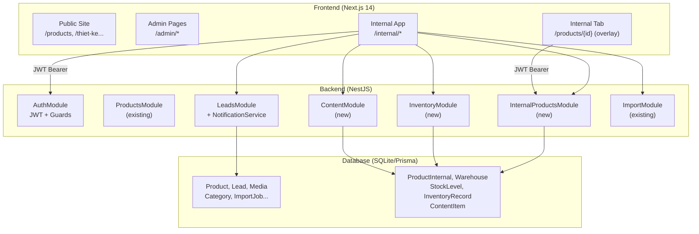

# Design Document: Internal Operations Mode

## Overview

Internal Operations Mode là một shell ứng dụng nội bộ mobile-first chạy song song với hệ thống `/admin` hiện có, được truy cập tại route `/internal`. Ứng dụng phục vụ nhân viên showroom và kho của Phú Cường Thịnh — cho phép tra cứu thông tin sản phẩm qua QR, theo dõi leads, quản lý catalogue, quản lý nội dung, và ghi nhận xuất nhập kho — tất cả được tối ưu cho thiết bị di động.

Hệ thống tái sử dụng toàn bộ auth infrastructure hiện có (JWT, role `admin`, `useAuth` hook từ `@repo/shared-utils`). Không có role mới, không có hệ thống phân quyền riêng — mọi admin đều có quyền truy cập đầy đủ Internal App.

### Phạm vi thiết kế

- **Frontend**: Next.js 14, route group `(internal)`, bottom navigation 5 tab
- **Backend**: NestJS, 3 module mới: `InternalProductsModule`, `InventoryModule`, `ContentModule`; mở rộng `LeadsModule` với email notification
- **Database**: Prisma schema mở rộng với 5 model mới: `ProductInternal`, `Warehouse`, `StockLevel`, `InventoryRecord`, `ContentItem`

---

## Architecture

### Tổng quan hệ thống



### Route Structure

```
/internal                    → redirect → /internal/home
/internal/home               → HomeTab (QR Scanner + quick stats)
/internal/warehouse          → WarehouseTab (stock levels + inventory records)
/internal/leads              → LeadsTab (lead list + badge)
/internal/catalogue          → CatalogueTab (product list + add/edit + PDF import)
/internal/management         → ManagementTab (content items)
/internal/products/[id]      → Internal product detail
```

### Auth Flow

Internal App tái sử dụng hoàn toàn auth flow của `/admin`:

- `useAuth()` từ `@repo/shared-utils` — kiểm tra JWT trong localStorage
- Unauthenticated → redirect `/admin/login?returnTo=/internal`
- Authenticated với role `admin` → cho phép truy cập
- `AdminGuard` pattern được copy sang `InternalGuard` trong layout riêng

---

## Components and Interfaces

### Frontend Components

#### InternalShell (layout)

```
packages/frontend/src/app/(internal)/layout.tsx
```

- Wrap toàn bộ `/internal/*` routes
- Render `InternalGuard` (auth check)
- Render `BottomNav` cố định ở đáy
- Không render `Header` / `Footer` của public site
- `padding-bottom: 80px` cho content area

#### BottomNav

```
packages/frontend/src/components/internal/BottomNav.tsx
```

5 tab theo thứ tự: Kho | Leads | Home | Catalogue | Quản lý

```typescript
interface BottomNavTab {
  href: string;
  label: string;
  icon: React.ReactNode;
  badge?: number; // cho Leads tab
}
```

Touch target tối thiểu 44×44px. Active state dựa trên `usePathname()`.

#### QRScanner

```
packages/frontend/src/components/internal/QRScanner.tsx
```

Sử dụng thư viện `html5-qrcode` (hoặc `@zxing/browser`). Khi decode thành công:

- Parse product ID hoặc SKU từ QR content
- Gọi `GET /products/sku/{sku}` hoặc navigate trực tiếp đến `/internal/products/{id}`
- Lỗi → toast notification trong 2 giây

#### InternalProductInfo

```
packages/frontend/src/components/internal/InternalProductInfo.tsx
```

Hiển thị data từ `GET /products/{id}/internal`. Dùng cả trong:

- `/internal/products/{id}` (full page)
- Tab "Nội bộ" trên `/products/{id}` public (overlay panel)

#### LeadsBadge

Badge số lượng leads `status = 'new'` trên BottomNav. Fetch từ `GET /leads?status=new&limit=1` để lấy total count. Refresh mỗi 60 giây.

### Backend Modules

#### InternalProductsModule

```
packages/backend/src/internal-products/
├── internal-products.controller.ts
├── internal-products.service.ts
├── internal-products.module.ts
└── dto/
    ├── update-internal-product.dto.ts
    └── internal-product-response.dto.ts
```

Endpoints:

- `GET /products/:id/internal` — trả về `ProductInternal` + `StockLevel[]` (JWT required)
- `PATCH /products/:id/internal` — cập nhật `ProductInternal` (JWT required)

#### InventoryModule

```
packages/backend/src/inventory/
├── inventory.controller.ts
├── inventory.service.ts
├── inventory.module.ts
└── dto/
    ├── create-inventory-record.dto.ts
    └── stock-query.dto.ts
```

Endpoints:

- `GET /inventory/stock` — tổng hợp StockLevel theo product + warehouse (JWT required)
- `POST /inventory/records` — tạo InventoryRecord mới, cập nhật StockLevel (JWT required)
- `GET /inventory/records/:productId` — lịch sử records của một sản phẩm (JWT required)
- `GET /warehouses` — danh sách warehouses (JWT required)

#### ContentModule

```
packages/backend/src/content/
├── content.controller.ts
├── content.service.ts
├── content.module.ts
└── dto/
    ├── create-content-item.dto.ts
    └── update-content-item.dto.ts
```

Endpoints:

- `GET /content` — danh sách ContentItem, filter theo `type` (JWT required)
- `POST /content` — tạo ContentItem mới (JWT required)
- `PATCH /content/:id` — cập nhật ContentItem (JWT required)
- `DELETE /content/:id` — xóa ContentItem (JWT required)

#### LeadsModule — mở rộng NotificationService

```
packages/backend/src/leads/notification.service.ts  (new)
```

Inject vào `LeadsService.create()`. Gửi email async (fire-and-forget) sau khi Lead được persist. Sử dụng `nodemailer` với SMTP config từ env vars. Lỗi gửi mail → log, không throw.

---

## Data Models

### Prisma Schema — các model mới

```prisma
model ProductInternal {
  id               String   @id @default(cuid())
  product_id       String   @unique
  cost_price       Float?
  supplier_name    String?
  supplier_contact String?
  internal_notes   String?
  created_at       DateTime @default(now())
  updated_at       DateTime @updatedAt

  product      Product      @relation(fields: [product_id], references: [id], onDelete: Cascade)
  stock_levels StockLevel[]

  @@map("product_internals")
}

model Warehouse {
  id          String   @id @default(cuid())
  name        String
  location    String?
  is_active   Boolean  @default(true)
  created_at  DateTime @default(now())
  updated_at  DateTime @updatedAt

  stock_levels      StockLevel[]
  inventory_records InventoryRecord[]

  @@map("warehouses")
}

model StockLevel {
  id                  String   @id @default(cuid())
  product_id          String
  warehouse_id        String
  quantity            Int      @default(0)
  updated_at          DateTime @updatedAt

  product_internal ProductInternal @relation(fields: [product_id], references: [product_id])
  warehouse        Warehouse       @relation(fields: [warehouse_id], references: [id])

  @@unique([product_id, warehouse_id])
  @@index([product_id])
  @@index([warehouse_id])
  @@map("stock_levels")
}

model InventoryRecord {
  id           String   @id @default(cuid())
  product_id   String
  warehouse_id String
  type         String   // "in" | "out" | "adjustment"
  quantity     Int
  note         String?
  created_by   String
  created_at   DateTime @default(now())

  warehouse Warehouse @relation(fields: [warehouse_id], references: [id])

  @@index([product_id])
  @@index([warehouse_id])
  @@index([created_at])
  @@map("inventory_records")
}

model ContentItem {
  id           String   @id @default(cuid())
  title        String
  type         String   // "design" | "project" | "construction"
  description  String?
  is_published Boolean  @default(false)
  images       String   @default("[]") // JSON array of media URLs
  created_at   DateTime @default(now())
  updated_at   DateTime @updatedAt

  @@index([type])
  @@index([is_published])
  @@map("content_items")
}
```

### Quan hệ với model hiện có

- `ProductInternal` → `Product` (1-1, cascade delete)
- `StockLevel` → `ProductInternal` via `product_id`, `Warehouse` (many-to-many junction)
- `InventoryRecord` → `Warehouse` (many-to-1)
- `ContentItem` — standalone, không liên kết với model hiện có

### Email Notification Config (env vars)

```
OWNER_EMAIL=owner@example.com
SMTP_HOST=smtp.example.com
SMTP_PORT=587
SMTP_USER=user@example.com
SMTP_PASS=secret
SMTP_FROM=noreply@example.com
```

---

## Correctness Properties

_A property is a characteristic or behavior that should hold true across all valid executions of a system — essentially, a formal statement about what the system should do. Properties serve as the bridge between human-readable specifications and machine-verifiable correctness guarantees._

### Property 1: Unauthenticated redirect cho mọi internal route

_For any_ sub-path dưới `/internal/*`, khi người dùng chưa xác thực truy cập, hệ thống phải redirect đến `/admin/login` với `returnTo` parameter chứa đúng path đó.

**Validates: Requirements 1.3**

---

### Property 2: BottomNav active state theo pathname

_For any_ pathname hợp lệ trong Internal App, tab được highlight trong BottomNav phải là tab có href khớp với pathname hiện tại.

**Validates: Requirements 1.7, 1.8**

---

### Property 3: QR scan với valid product dẫn đến đúng trang

_For any_ QR content chứa product ID hoặc SKU hợp lệ tồn tại trong database, QRScanner phải navigate đến `/internal/products/{id}` tương ứng.

**Validates: Requirements 2.2**

---

### Property 4: QR scan với invalid content hiển thị lỗi

_For any_ QR content không chứa product ID hoặc SKU hợp lệ, QRScanner phải hiển thị thông báo lỗi (không crash, không navigate).

**Validates: Requirements 2.3**

---

### Property 5: Internal product info response đầy đủ các trường

_For any_ product có `ProductInternal` record, response từ `GET /products/{id}/internal` phải chứa đầy đủ: `cost_price`, `supplier_name`, `supplier_contact`, `internal_notes`, và mảng `stock_levels` với `warehouse_id`, `quantity`.

**Validates: Requirements 2.4, 3.1, 3.2, 3.5**

---

### Property 6: Protected endpoints yêu cầu JWT hợp lệ

_For any_ request đến các endpoint nội bộ (`GET /products/{id}/internal`, `PATCH /products/{id}/internal`, `GET /inventory/stock`, `POST /inventory/records`, `GET /content`, `POST /content`, `PATCH /content/{id}`, `DELETE /content/{id}`), request không có JWT hoặc JWT không hợp lệ phải nhận response 401.

**Validates: Requirements 2.7, 3.6, 7.7, 7.8**

---

### Property 7: Stock level không âm — từ chối xuất kho vượt tồn kho

_For any_ `InventoryRecord` với `type = "out"` và `quantity > current_stock_level`, hệ thống phải từ chối thao tác và trả về lỗi validation, stock level không thay đổi.

**Validates: Requirements 3.4, 7.3**

---

### Property 8: Nhập kho tăng stock level đúng số lượng

_For any_ `InventoryRecord` với `type = "in"` và `quantity = q`, stock level của sản phẩm tại kho tương ứng phải tăng đúng `q` đơn vị sau khi record được tạo.

**Validates: Requirements 7.2**

---

### Property 9: Email notification được gửi khi tạo lead

_For any_ lead được tạo thành công qua `POST /leads`, `NotificationService` phải được gọi với recipient là `OWNER_EMAIL` và email body phải chứa: tên khách hàng, số điện thoại, email, loại yêu cầu, thời gian tạo.

**Validates: Requirements 4.1, 4.3**

---

### Property 10: Lỗi email không rollback việc tạo lead

_For any_ lead creation khi `NotificationService` throw error, lead vẫn phải tồn tại trong database sau khi operation hoàn thành.

**Validates: Requirements 4.4**

---

### Property 11: Lead status transition hợp lệ

_For any_ lead, các transition hợp lệ là: `new → contacted`, `contacted → converted`. Transition sang status không hợp lệ phải bị từ chối với lỗi validation.

**Validates: Requirements 4.7**

---

### Property 12: ContentItem validation — trường bắt buộc

_For any_ request tạo `ContentItem` thiếu `title`, thiếu `type`, hoặc không có ảnh nào, hệ thống phải từ chối và trả về lỗi validation, không tạo record.

**Validates: Requirements 6.2**

---

### Property 13: ContentItem data persistence round-trip

_For any_ `ContentItem` được tạo với random valid data, đọc lại record từ database phải trả về đúng các trường: `title`, `type`, `description`, `is_published`, `images`.

**Validates: Requirements 6.3**

---

### Property 14: Publish ContentItem hiển thị trên public endpoint

_For any_ `ContentItem`, khi `is_published` được set thành `true`, item đó phải xuất hiện trong response của public content endpoint tương ứng. Khi `is_published = false`, item không được xuất hiện.

**Validates: Requirements 6.5**

---

### Property 15: ContentItem CRUD round-trip

_For any_ `ContentItem` được tạo, sau khi update với random valid data thì đọc lại phải trả về data mới; sau khi delete thì không còn tồn tại trong database.

**Validates: Requirements 6.6**

---

### Property 16: Inventory records được sắp xếp theo thời gian giảm dần

_For any_ danh sách `InventoryRecord` của một sản phẩm, `created_at` của record ở vị trí `i` phải >= `created_at` của record ở vị trí `i+1`.

**Validates: Requirements 7.5**

---

### Property 17: Loading state hiển thị trong async operations

_For any_ component thực hiện API call, trong khoảng thời gian từ khi call bắt đầu đến khi nhận response, component phải render loading indicator.

**Validates: Requirements 8.4**

---

### Property 18: API error hiển thị thông báo tiếng Việt và nút thử lại

_For any_ API call thất bại (network error hoặc 4xx/5xx response), UI phải hiển thị error message bằng tiếng Việt và render nút "Thử lại".

**Validates: Requirements 8.5**

---

## Error Handling

### Frontend

| Tình huống                | Xử lý                                                                                                |
| ------------------------- | ---------------------------------------------------------------------------------------------------- |
| JWT hết hạn               | `onUnauthorized` callback → clear localStorage → dispatch `auth:unauthorized` event → redirect login |
| API call thất bại         | Toast/inline error bằng tiếng Việt + nút "Thử lại"                                                   |
| QR decode thất bại        | Toast error trong 2 giây, không navigate                                                             |
| QR product không tồn tại  | Toast "Không tìm thấy sản phẩm" trong 2 giây                                                         |
| Upload file sai định dạng | Validate client-side trước khi upload, hiển thị lỗi ngay                                             |
| Upload file quá 10MB      | Validate client-side, hiển thị lỗi kích thước                                                        |

### Backend

| Tình huống                            | Xử lý                                                            |
| ------------------------------------- | ---------------------------------------------------------------- |
| Tạo InventoryRecord xuất kho vượt tồn | `BadRequestException("Số lượng xuất vượt quá tồn kho")`          |
| StockLevel quantity âm                | `BadRequestException` từ validation                              |
| SKU trùng khi tạo sản phẩm            | Prisma unique constraint → `ConflictException("SKU đã tồn tại")` |
| Email notification thất bại           | Log error, không throw, không rollback lead                      |
| Product không có ProductInternal      | Trả về `null` cho internal fields, không 404                     |
| Request không có JWT                  | `JwtAuthGuard` → 401 Unauthorized                                |

---

## Testing Strategy

### Dual Testing Approach

Cả unit tests và property-based tests đều cần thiết và bổ sung cho nhau:

- **Unit tests**: Kiểm tra các ví dụ cụ thể, edge cases, integration points
- **Property tests**: Kiểm tra các invariants trên tập input rộng

### Property-Based Testing

Sử dụng **fast-check** (TypeScript/JavaScript) cho cả frontend và backend tests.

Mỗi property test phải:

- Chạy tối thiểu **100 iterations**
- Được tag với comment: `// Feature: internal-ops-mode, Property {N}: {property_text}`
- Map 1-1 với một Correctness Property trong design document

Ví dụ:

```typescript
// Feature: internal-ops-mode, Property 7: Stock level không âm
it("should reject out-record when quantity exceeds stock", () => {
  fc.assert(
    fc.property(
      fc.integer({ min: 1, max: 1000 }), // current stock
      fc.integer({ min: 1, max: 500 }), // excess amount
      async (stock, excess) => {
        // setup: create product with stock level = stock
        // act: create out-record with quantity = stock + excess
        // assert: throws BadRequestException
      },
    ),
    { numRuns: 100 },
  );
});
```

### Unit Tests

Tập trung vào:

- **Auth guard**: Kiểm tra redirect behavior với unauthenticated user
- **BottomNav**: Render đúng 5 tab, đúng thứ tự, đúng active state
- **Email notification**: Mock nodemailer, kiểm tra email content
- **Lead status transitions**: Kiểm tra valid/invalid transitions
- **ContentItem validation**: Kiểm tra required fields
- **API integration**: Kiểm tra response shape của các endpoint mới

### Test Files Structure

```
packages/backend/src/
├── internal-products/internal-products.service.spec.ts
├── inventory/inventory.service.spec.ts
├── content/content.service.spec.ts
└── leads/notification.service.spec.ts

packages/frontend/src/
├── components/internal/BottomNav.spec.tsx
├── components/internal/QRScanner.spec.tsx
└── app/(internal)/layout.spec.tsx
```
